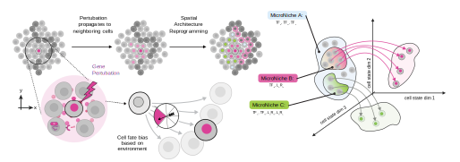

[](https://github.com/Koushul/SpaceOracle/actions/workflows/python-package-conda.yml)


<p align="center">
  
</p>

Cell intrinsic regulation is captured through transcription factor (TF) terms, while signaling is modeled via distance-weighted ligand expression from neighboring sender cells to each receiver cell Specifically, signaling is captured based on both ligand-receptor and ligand-TF associations. To integrate spatial information while maintaining biological interpretability, SpaceTravLR leverages convolutional neural networks to generate a sparse graph with differentiable edges. This architecture enables signals to propagate both within cells through regulatory edges and between cells through ligand–mediated connections, and is mathematically computed by efficient, gradient-based perturbation analysis via the chain rule. 

# Why SpaceTravLR 🌔️ ?


## Core Features
- inferring functional cell-cell communications events
- *in-silico* modeling of functional and spatial reprogramming following perturbations
- identifying spatial domains and functional microniches and their driver genes

Read more on our [documentation website](https://).


##  Quick start

Install dependencies
```bash
pip install -r requirements.txt
```

To start using SpaceTravLR, check out our [documentation](https://microsoft.github.io/agent-lightning/) and [examples](./examples).

##  Example

##  Outputs

##  Results


##  Parallel Training & Inference
SpaceTravLR implements a scalable pipeline leveraging high performance computing for parallelized tensor computations to estimate the target gene expression based on spatially varying regulatory and signaling dynamics. 


##  FAQ
<details>
<summary><strong>How long does SpaceTravLR take to train?</strong></summary>
</details>


<details>
<summary><strong>Do I need paired ATAC-seq data?</strong></summary>
</details>


## Citation

If you find SpaceTravLR useful in your research or projects, please cite our paper:
```