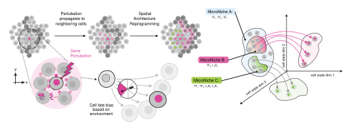
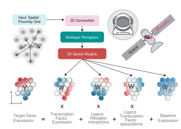

[](https://github.com/Koushul/SpaceOracle/actions/workflows/python-package-conda.yml)

# Why SpaceTravLR 🌔️ ?

**SpaceTravLR** (**S**patially perturbing **T**ranscription factors, **L**igands & **R**eceptors)


<p align="center">
  
</p>

SpaceTravLR leverages convolutional neural networks to generate a sparse graph with differentiable edges. This enables signals to propagate both within cells through regulatory edges and between cells through ligand–mediated connections.

<p align="center">
  
</p>


## Core Features
- predicting niche-specific perturbation outcome at single cell resolution
- inferring functional cell-cell communications events
- identifying spatial domains and functional microniches and their driver genes


##  Quick start

**Note:** We ***highly*** recommend following the Rust tutorial. This section is provided for development purposes only. You can find the tutorial here: https://spacetravlr-rust.readthedocs.io/en/latest/

```bash
pip install SpaceTravLR==0.1.19
```


## Installing from Source
```bash
uv venv
source .venv/bin/activate
uv sync
```


Load the example [Slide-tags]((https://www.nature.com/articles/s41586-023-06837-4)) Human Tonsil data.

```python
adata = sc.read_h5ad('data/snrna_germinal_center.h5ad')
```

Create a SpaceShip
```python
from SpaceTravLR.spaceship import SpaceShip

spacetravlr = SpaceShip(name='myTonsil').setup_(adata)

assert spacetravlr.is_everything_ok()

spacetravlr.spawn_worker(
    python_path='.venv/bin/python',
    partition='preempt'
)
```

SpaceTravLR generates a queue of genes that each worker consumes in parallel. spacetravlr.spawn_worker submits a new job to the clusters.


##  Outputs
<pre>
output/
├── input_data/
│   ├── _adata.h5ad
│   ├── celloracle_links.pkl
│   ├── communication.pkl
│   ├── LRs.parquet
├── betadata/
│   ├── PAX5_betadata.parquet
│   ├── FOXO1_betadata.parquet
│   ├── CD79A_betadata.parquet
│   ├── ...
│   ├── IL21_betadata.parquet
│   ├── IL4_betadata.parquet
│   ├── CCR4_betadata.parquet
├── logs/
│   ├── training_TIMESTAMP.log

</pre>

##  Results

<p align="center">
  
</p>


## Citation

If you find SpaceTravLR useful in your research or projects, please cite our paper:
```
